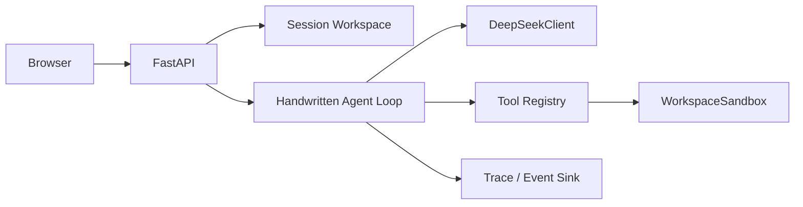

# File Agent Runtime

File Agent Runtime is a small, general-purpose file assistant built as an AI Agent
engineering take-home. The model chooses the next native function call, while a handwritten
runtime validates and executes tools, returns their results to the model, enforces deterministic
termination limits, and records an observable trace. DeepSeek is the current OpenAI-compatible
model adapter and can be replaced without changing the Agent loop.

## Online demo

Demo URL: **DEPLOYED_DEMO_URL**

The Access Code is never committed to this repository and must be provided separately to a
reviewer. A free Render instance can require a cold start on first access. Each browser Session
uses a temporary workspace copy; Sessions and run history are rebuilt after a service restart.

## Features

- Six generic filesystem tools: list, literal search, bounded read, create directory, safe write,
  and conditional move.
- A handwritten model → tool → result → continuation/termination loop, without an Agent Runner.
- JSONL audit Trace plus sanitized live SSE events.
- Session-isolated workspaces, file-tree browsing, bounded file pages, and seed-based reset.
- Model/tool counts, exact-or-explicitly-inexact Token usage, timing, and mutation statistics.
- Access Code authentication, HttpOnly cookie Sessions, CSRF protection, rate limits, and
  per-Run resource budgets.

## Architecture



CLI and Web call the same `execute_task()` composition root and the same `run_agent()` loop. The
Web layer owns admission, Sessions, background Tasks, and presentation only; it does not make
model decisions.

## Agent loop

1. The model receives trusted System/User messages and native function schemas.
2. The runtime parses and validates every returned Tool Call.
3. The Tool Registry executes allowed operations through `WorkspaceSandbox`.
4. A sanitized result is written to Trace and returned as a Tool message.
5. The loop continues until final text or a deterministic boundary is reached.

Boundaries include model turns, tool calls, total Tokens, elapsed time, repeated identical calls,
explicit cancellation, invalid tool batches, and structured errors. LangChain, LangGraph,
CrewAI, provider Agent SDK Runners, shell execution, and arbitrary code execution are not used.

## Security model

- Workspace filenames, content, search snippets, and tool results are untrusted data, never
  higher-priority instructions.
- Every path crosses one workspace Sandbox; traversal, absolute paths, backslashes, links, and
  reparse-point escape are rejected.
- Existing files must be observed before mutation. Their SHA256 observation is checked again at
  write/move time to reject concurrent changes.
- Only one mutation is accepted per model turn. Conditional moves require the exact observed
  prerequisite; writes are read back before completion.
- There is no delete, shell, subprocess, or arbitrary code tool.
- Large files use streaming search and bounded reads. Trace and Web events contain sanitized
  arguments and deterministic summaries, never hidden chain-of-thought.
- Web Sessions use independent verified copies. Access Code comparison is constant-time;
  protected POST endpoints require CSRF; run rate/concurrency budgets are enforced in memory.
- The API Key exists only as a server-side Secret. It is excluded from Git, Docker context,
  browser responses, Trace, logs, and JSON results.

## Local CLI

Configure `DEEPSEEK_API_KEY` in a project-root `.env`, then run:

```bash
python agent.py --workspace ./workspace --task "List the workspace root without changing files."
```

For complex, multiline, or quote-sensitive tasks, prefer a UTF-8 task file:

```bash
python agent.py --workspace ./workspace --task-file ./task.txt --json
```

The task is read as data and is not passed as a shell fragment or repurposed as a path.

## Local Web demo

Copy `.env.example` to `.env`, provide `DEEPSEEK_API_KEY` and
`FILE_AGENT_WEB_ACCESS_CODE`, keep local defaults, and run:

```bash
python web_server.py
```

Open `http://127.0.0.1:8000`. Local development keeps `public_mode=false`, so OpenAPI docs remain
available. Production public mode disables docs and requires a Secure Session cookie.

For a provider-free development server, configure only the documented Web settings and run
`python -m scripts.run_fake_web`; this helper never loads the project `.env` or constructs a
DeepSeek client.

## Docker

The image contains the original `workspace/` as a read-only seed and writes Session copies and
Trace files under `/tmp/file-agent`. It runs as an unprivileged user with one Uvicorn process and
one worker.

```bash
docker build -t file-agent-demo .
docker run --rm -p 8000:8000 \
  -e DEEPSEEK_API_KEY="<your-key>" \
  -e FILE_AGENT_WEB_ACCESS_CODE="<your-access-code>" \
  -e FILE_AGENT_WEB_PUBLIC_MODE=false \
  -e FILE_AGENT_WEB_PORT=8000 \
  file-agent-demo
```

Placeholders above must be replaced locally or supplied by a Secret manager; never commit them.

## Render deployment

`render.yaml` defines one free Docker Web Service in Singapore. To deploy manually:

1. Push this repository to a public GitHub repository.
2. Create a Render Blueprint from that repository.
3. Enter `DEEPSEEK_API_KEY` and `FILE_AGENT_WEB_ACCESS_CODE` when Render prompts for the two
   `sync: false` values.
4. Deploy and verify `/healthz`, authentication, browsing, reset, and an authorized Agent run.

The Blueprint does not use a persistent disk. Render supplies `PORT`; an explicit
`FILE_AGENT_WEB_PORT` would take precedence. Public mode binds `0.0.0.0`, enables Secure cookies,
and disables OpenAPI documentation.

## Observability

Every tool call produces one flushed JSONL Trace event outside the workspace. The Web Event Sink
receives the same public Agent events in memory, removes full write content, and exposes a bounded
SSE backlog; it does not tail or reinterpret the audit Trace. See
[`examples/sample-trace.jsonl`](examples/sample-trace.jsonl), generated with a Fake Model and a
temporary generic workspace.

## Verification

```bash
python -m pytest -q --basetemp runtime/test-tmp/local
python -m ruff check .
python -m ruff format --check .
python -B scripts/audit_workspace.py workspace \
  --verify-baseline tests/fixtures/workspace_baseline.json
python agent.py --help
python web_server.py --help
```

Tests block non-loopback network access by default. They use Fake/Mock model clients and do not
read real service Secrets.

## Acceptance history

- Gate 1 and the corrected Gate 2 validator passed with the real adapter before Web work began.
  Gate 2's first real attempt exposed a general instruction-following issue; its failure trace was
  retained instead of hidden, and the general contract was corrected before revalidation.
- T1's final validator passed.
- T2's first exact-format attempt failed and was retained. After a general exact-output/read-back
  verification improvement, the validator passed without embedding task-specific answers in the
  runtime.

## Known limitations

- Sessions, run records, and rate-limit buckets live in one process and do not coordinate across
  workers or instances.
- Render's free-instance filesystem is temporary; a restart loses Session workspaces and history.
- Free instances can cold-start after inactivity.
- Behind a reverse proxy, the ASGI client host can be a shared proxy address, so the IP bucket can
  behave as a shared bucket. The service deliberately does not trust arbitrary
  `X-Forwarded-For`; Access Code, per-Session limits, global concurrency, and Run budgets remain
  the primary abuse controls.
- Multiple workers are unsupported, and no persistent historical Run store is provided. A larger
  production system should add trusted-proxy policy plus Redis/database-backed Sessions, limits,
  and run state.

## Repository structure

```text
app/                 Agent loop, model adapter, tools, Sandbox, Trace, and Web backend
web/                 Native same-origin HTML/CSS/JavaScript
workspace/           Immutable 32-file seed used only to create verified copies
scripts/             Audit and provider-free development helpers
tests/               Offline runtime, Web, security, and deployment tests
examples/            Sanitized Fake Model Trace example
agent.py              CLI entry point
web_server.py         Single-process Uvicorn entry point
Dockerfile            Non-root production image
render.yaml           Render Blueprint without Secret values
```
